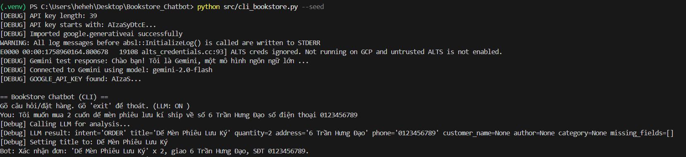
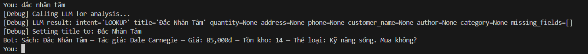
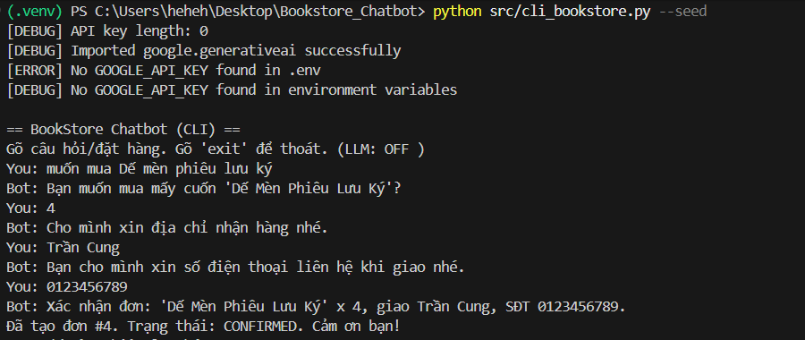
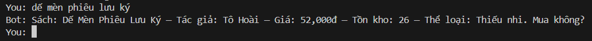

# BookStore Chatbot

Một chatbot đơn giản bằng tiếng Việt để tìm kiếm và đặt sách. Chatbot hỗ trợ xử lý ngôn ngữ tự nhiên bằng Google Gemini API hoặc phương pháp heuristic.

## Tính năng

- 🔍 Tìm kiếm sách theo:
  - Tên sách
  - Tác giả
  - Thể loại
- 🛍️ Đặt hàng với các thông tin:
  - Số lượng
  - Địa chỉ giao hàng
  - Số điện thoại liên hệ
- 🤖 Xử lý ngôn ngữ tự nhiên:
  - Hỗ trợ Google Gemini API cho hiểu ý định người dùng
  - Fallback về heuristic khi không có API key
- 📝 Các tính năng khác:
  - Hỗ trợ tiếng Việt có dấu và không dấu
  - Lưu trữ dữ liệu bằng SQLite
  - Xử lý đồng thời (thread-safe) cho đơn hàng

## Cài đặt

1. Clone repository và tạo môi trường ảo:
```bash
git clone <repository-url>
cd Bookstore_Chatbot
python -m venv .venv
```

2. Kích hoạt môi trường ảo:
- Windows:
```powershell
.\.venv\Scripts\Activate.ps1
```
- Linux/Mac:
```bash
source .venv/bin/activate
```

3. Cài đặt các thư viện cần thiết:
```bash
pip install -r requirements.txt
```

4. Cấu hình môi trường:
- Tạo file `.env` với nội dung:
```
GOOGLE_API_KEY=your_api_key_here  # Tùy chọn, bỏ qua nếu không dùng Gemini
DB_PATH=bookstore.db
```

## Sử dụng

1. Chạy với dữ liệu mẫu:
```bash
python cli_bookstore.py --seed
```

2. Chạy bình thường:
```bash
python cli_bookstore.py
```


## Ví dụ sử dụng
### Khi có LLM (LLM: ON) thì chatbot có thể hiểu và xử lí tốt hơn input của người dùng
#### Đặt hàng

#### Tra cứu


### Chế độ Heuristic (LLM: OFF)
Khi không có LLM, chatbot sử dụng cơ chế heuristic (quy tắc đơn giản) để xử lý input:

1. Nhận diện ý định:
   - ORDER: chứa từ khóa "mua", "đặt", "lấy"
   - LOOKUP: chứa từ khóa "có", "giá", "còn", "tìm"
   - UNKNOWN: không khớp với các pattern trên

2. Trích xuất thông tin:
   - Tên sách: text giữa từ khóa và dấu câu/kết thúc
   - Số lượng: số đứng trước "cuốn", "quyển"
   - SĐT: chuỗi số có 10-11 chữ số
   - Địa chỉ: text có chứa các từ khóa về địa chỉ

3. Giới hạn:
   - Không hiểu câu phức tạp/nhiều ý định
   - Cần tuân thủ cấu trúc câu chuẩn
   - Dễ bị nhiễu bởi từ đồng âm khác nghĩa

#### Đặt hàng


#### Tra cứu

